# CartSystem Architecture and Design

## Table of Contents

- [Design Goals](#design-goals)
- [System Context](#system-context)
- [Architecture Overview](#architecture-overview)
- [Request Lifecycle](#request-lifecycle)
- [Folder Structure](#folder-structure)
- [Database Schema Design](#database-schema-design)
- [Core Workflows](#core-workflows)
- [Promotion Engine Design](#promotion-engine-design)
- [Validation and Error Strategy](#validation-and-error-strategy)
- [Security Strategy](#security-strategy)
- [Feature X: Cart Expiration](#feature-x-cart-expiration)
- [Consistency and Concurrency](#consistency-and-concurrency)
- [Edge Cases](#edge-cases)
- [Trade-offs](#trade-offs)
- [Scalability and Future Evolution](#scalability-and-future-evolution)

## Design Goals

CartSystem was designed around the following goals:

- Maintain a clear Route -> Controller -> Service -> Model architecture.
- Keep business logic outside controllers.
- Guarantee one active cart per user.
- Prevent cross-user cart-item mutations.
- Keep promotion logic reusable and independent from Express and MongoDB.
- Reject malformed data before it reaches business logic or persistence.
- Use database constraints as a second layer of protection.
- Automatically clean up abandoned carts without application schedulers.
- Return consistent JSON responses and errors.
- Remain easy to extend with authentication, orders, and payments.

## System Context

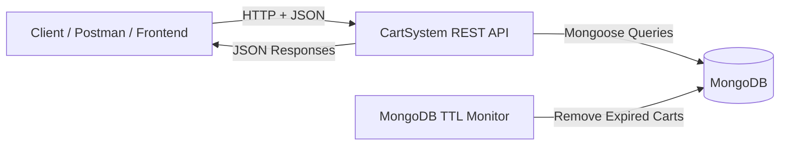

The current system is a backend API. Authentication, product catalog integration,
orders, and payment processing are intentionally outside the implemented scope.

## Architecture Overview

CartSystem uses a layered architecture:

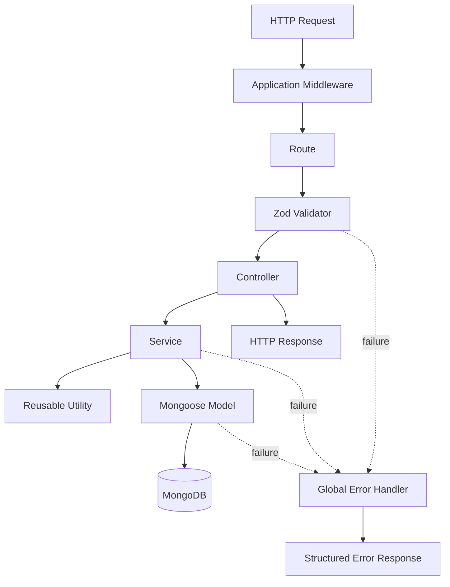

### Layer responsibilities

| Layer | Responsibility | Must not contain |
| --- | --- | --- |
| Route | HTTP method, path, middleware chain | Database logic |
| Validator | Input shape, type, and format validation | Business rules |
| Controller | Request extraction and response formatting | Database queries |
| Service | Business rules and persistence coordination | HTTP response logic |
| Model | Schema, relationships, indexes, constraints | Request handling |
| Utility | Pure reusable calculations | Express or database dependencies |
| Middleware | Cross-cutting HTTP concerns | Domain-specific workflows |

### Dependency direction

```text
Routes
  -> Controllers
      -> Services
          -> Models
          -> Utilities
```

Lower layers do not depend on controllers or routes. This keeps domain behavior
reusable and easier to test.

## Request Lifecycle

Middleware is registered in this order:

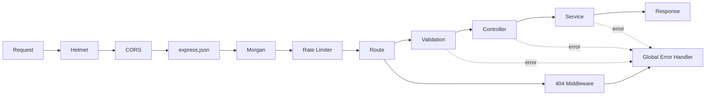

1. Helmet adds security-related HTTP headers.
2. CORS processes cross-origin requests.
3. Express parses JSON.
4. Morgan records the request.
5. Rate limiting protects all `/api` routes.
6. The router selects an endpoint.
7. Zod validates bodies and path parameters.
8. The controller calls a service.
9. The service executes business and persistence logic.
10. Errors flow to the centralized error middleware.

## Folder Structure

```text
src/
|-- config/
|   `-- db.js
|-- controllers/
|   |-- user.controller.js
|   |-- cart.controller.js
|   |-- cartItem.controller.js
|   `-- checkout.controller.js
|-- middlewares/
|   |-- validateRequest.js
|   |-- rateLimiter.js
|   |-- notFound.js
|   `-- errorHandler.js
|-- models/
|   |-- User.js
|   |-- Cart.js
|   `-- CartItem.js
|-- routes/
|   |-- health.routes.js
|   |-- user.routes.js
|   |-- cart.routes.js
|   |-- cartItem.routes.js
|   `-- checkout.routes.js
|-- services/
|   |-- user.service.js
|   |-- cart.service.js
|   |-- cartItem.service.js
|   `-- checkout.service.js
|-- utils/
|   `-- promotionEngine.js
|-- validators/
|   |-- user.validator.js
|   |-- cartItem.validator.js
|   `-- checkout.validator.js
|-- app.js
`-- server.js
```

## Database Schema Design

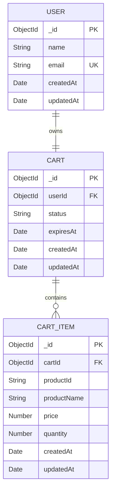

### User

| Field | Type | Constraints |
| --- | --- | --- |
| `name` | String | Required, trimmed, minimum two characters |
| `email` | String | Required, unique, lowercase, trimmed, email pattern |
| `createdAt` | Date | Mongoose timestamp |
| `updatedAt` | Date | Mongoose timestamp |

Email normalization prevents case-based duplicates such as `User@example.com` and
`user@example.com`.

### Cart

| Field | Type | Constraints |
| --- | --- | --- |
| `userId` | ObjectId | Required, immutable, references User |
| `status` | String | Required, enum containing `ACTIVE` |
| `expiresAt` | Date | Required, TTL expiration timestamp |
| `createdAt` | Date | Mongoose timestamp |
| `updatedAt` | Date | Mongoose timestamp |

Indexes:

```js
cartSchema.index(
  { userId: 1, status: 1 },
  {
    unique: true,
    partialFilterExpression: { status: "ACTIVE" }
  }
);

cartSchema.index(
  { expiresAt: 1 },
  { expireAfterSeconds: 0 }
);
```

The partial unique index enforces one active cart per user at the database level.

### CartItem

| Field | Type | Constraints |
| --- | --- | --- |
| `cartId` | ObjectId | Required, immutable, references Cart |
| `productId` | String | Required, trimmed, immutable |
| `productName` | String | Required and trimmed |
| `price` | Number | Required, minimum zero at model level |
| `quantity` | Number | Required, integer, minimum one |
| `createdAt` | Date | Mongoose timestamp |
| `updatedAt` | Date | Mongoose timestamp |

The compound unique index:

```js
cartItemSchema.index(
  { cartId: 1, productId: 1 },
  { unique: true }
);
```

prevents duplicate product rows inside the same cart.

## Core Workflows

### User registration and cart creation

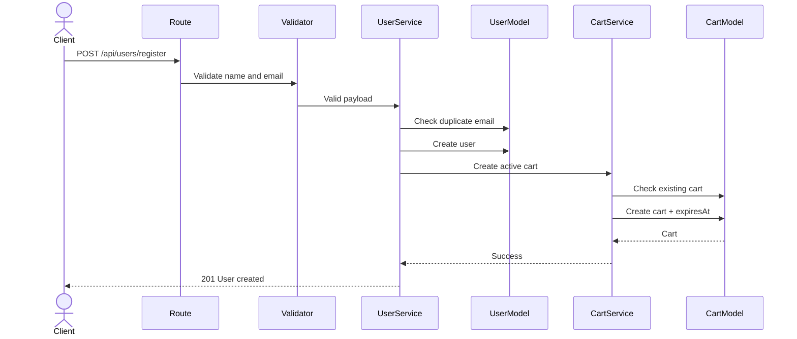

If cart creation fails after the user is inserted, the user service performs a
compensating deletion of the new user. This prevents a partially completed
registration from leaving a user without the required cart.

### Add or merge an item

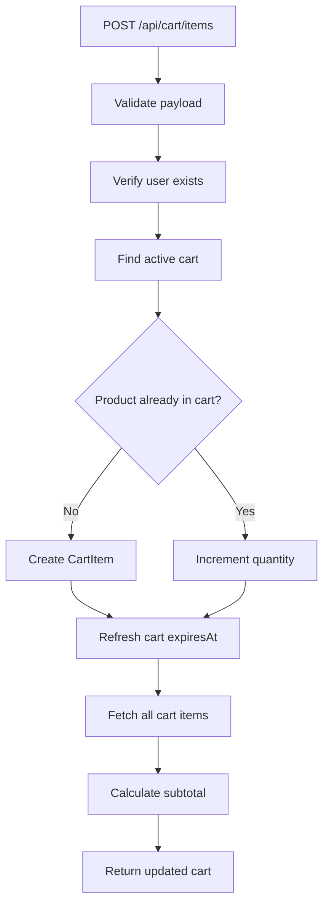

The service uses an atomic `findOneAndUpdate` upsert. The database's unique compound
index protects against duplicate product rows during concurrent requests.

### Update and delete isolation

Updates and deletions query using both:

```text
itemId + active cart owned by userId
```

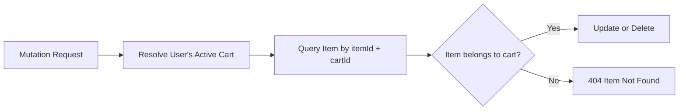

This prevents a user from modifying an item that belongs to another user's cart.

### View cart

The cart view workflow:

1. Validate `userId`.
2. Verify that the user exists.
3. Find the user's active cart.
4. Fetch CartItem documents using `cartId`.
5. Calculate `subtotal = sum(price * quantity)`.
6. Return the cart ID, items, and subtotal.

### Checkout

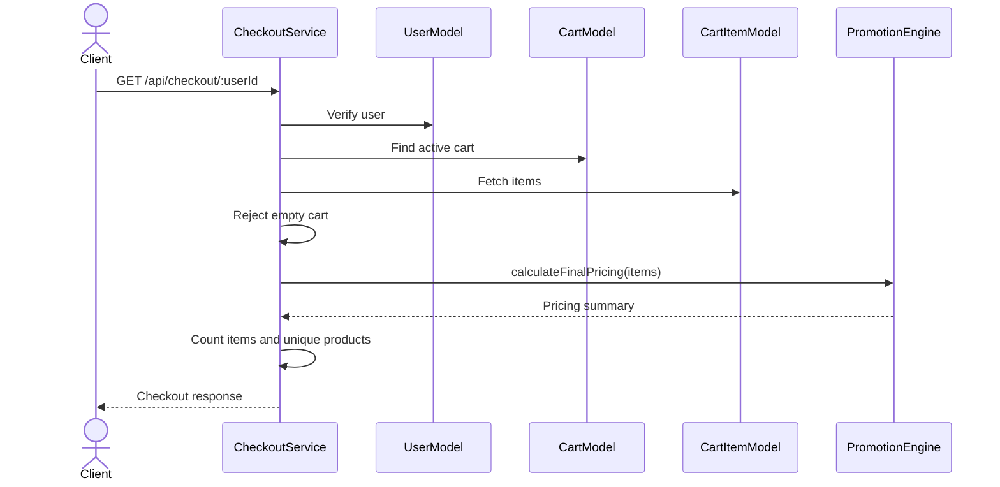

Checkout is read-only. It does not create an order, reserve inventory, or process a
payment.

## Promotion Engine Design

The promotion engine is a pure utility:

```text
Input: CartItem-like objects
Output: Deterministic pricing summary
Dependencies: None
Database access: None
Express access: None
```

### Calculation pipeline

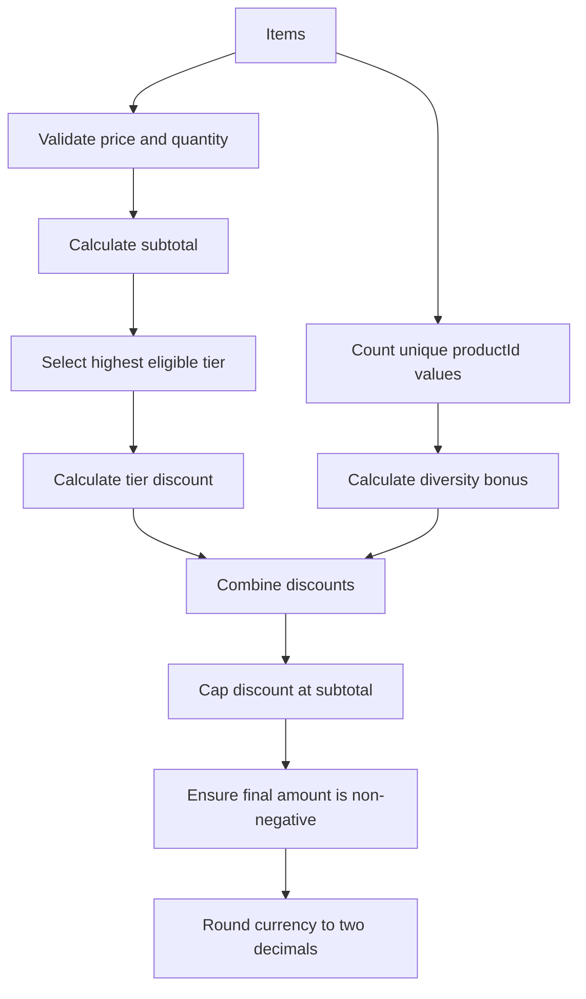

### Tier rules

| Tier | Minimum subtotal | Discount |
| --- | ---: | ---: |
| None | 0 | 0% |
| `TIER_1` | 5,000 | 5% |
| `TIER_2` | 10,000 | 10% |
| `TIER_3` | 20,000 | 15% |

Only the highest eligible tier is selected.

### Diversity bonus

Five or more unique product IDs add 3% of the original subtotal. The diversity bonus
stacks with the tier discount.

### Safety invariants

```text
totalDiscount <= subtotal
finalAmount >= 0
finalAmount = subtotal - totalDiscount
```

## Validation and Error Strategy

### Validation boundaries

Zod validates:

- User registration body
- User ID route parameter
- Add-item body
- Update-item body and item ID
- Delete-item body and item ID
- Cart-view user ID
- Checkout user ID

Strict schemas reject unknown body fields. Validation occurs before controllers.

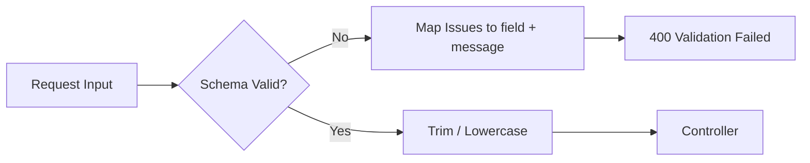

### Defense in depth

Validation is intentionally repeated at different boundaries:

| Boundary | Protection |
| --- | --- |
| Zod | Rejects malformed external requests |
| Service layer | Protects direct internal calls and business invariants |
| Mongoose schema | Protects stored document shape |
| MongoDB indexes | Protects uniqueness during concurrency |

### Error format

Validation:

```json
{
  "success": false,
  "message": "Validation Failed",
  "errors": [
    {
      "field": "quantity",
      "message": "Quantity must be greater than 0"
    }
  ]
}
```

Domain or system error:

```json
{
  "success": false,
  "message": "Item not found"
}
```

Stack traces are included only outside production.

## Security Strategy

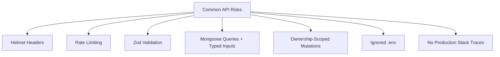

Implemented controls:

- Helmet security headers
- CORS middleware
- JSON body parsing with malformed-body handling
- 100 requests per IP per 15-minute window
- Strict validation and ObjectId checks
- Database uniqueness constraints
- Ownership-aware item update and delete queries
- Centralized errors
- `.env` excluded from source control
- Production stack-trace suppression

### Security boundary limitation

The current design does not authenticate the caller. `userId` is client-supplied.
The system enforces data isolation using that ID, but it does not prove that the
caller owns the identity. JWT-based authentication is a future requirement.

## Feature X: Cart Expiration

### Problem

Abandoned carts accumulate stale data, increase storage consumption, and create
operational cleanup work.

### Selected design

Each cart receives:

```text
expiresAt = current time + 30 minutes
```

Successful add, update, and delete operations reset the expiration time.

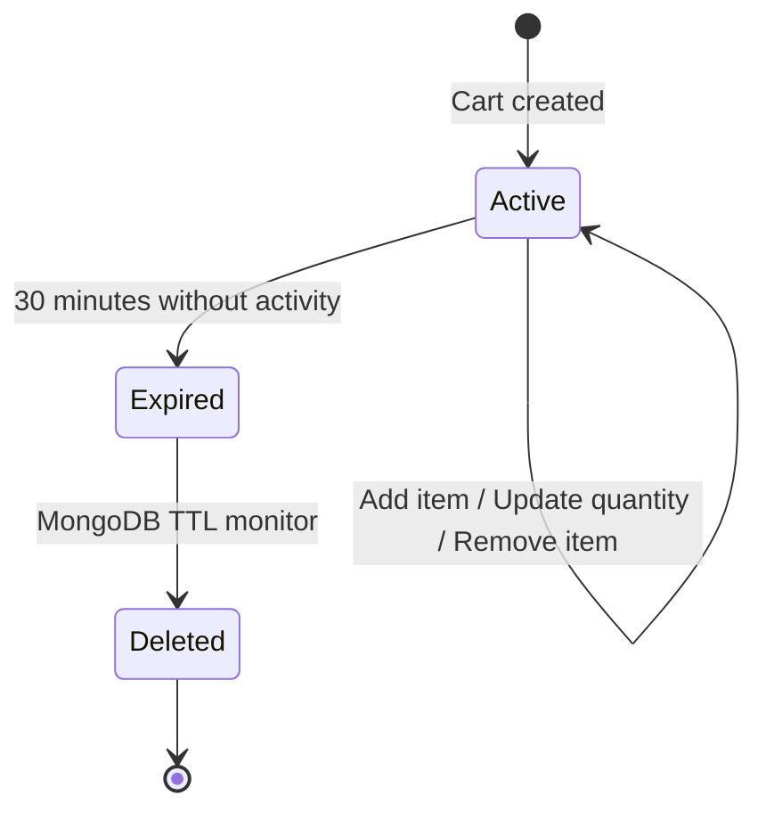

### Why MongoDB TTL

- No cron process
- No external scheduler
- No polling endpoint
- Works independently of API restarts
- Applies across multiple API instances
- Places lifecycle enforcement close to the data

### TTL behavior

The TTL index uses:

```js
{ expireAfterSeconds: 0 }
```

MongoDB interprets `expiresAt` as an absolute deletion time. A background monitor
periodically removes expired documents, so deletion can occur shortly after the
timestamp rather than exactly at it.

### Known lifecycle limitation

MongoDB does not cascade deletes. Removing a Cart through TTL does not automatically
remove its CartItem documents. A production evolution should address orphan items
through one of these approaches:

- Embed items inside Cart.
- Give CartItem its own compatible TTL field.
- Use a change stream cleanup worker.
- Run a controlled orphan-reconciliation process.

The assignment constraint specifically required native cart TTL without cron jobs,
so cascading cleanup was not added.

## Consistency and Concurrency

### Duplicate active carts

Protection exists at two levels:

1. The service checks for an existing active cart.
2. A unique partial index rejects concurrent duplicates.

### Duplicate products

Protection exists at two levels:

1. The service performs a cart-and-product upsert.
2. A unique `{ cartId, productId }` index prevents duplicate rows.

### User and cart creation

The workflow uses compensating deletion:

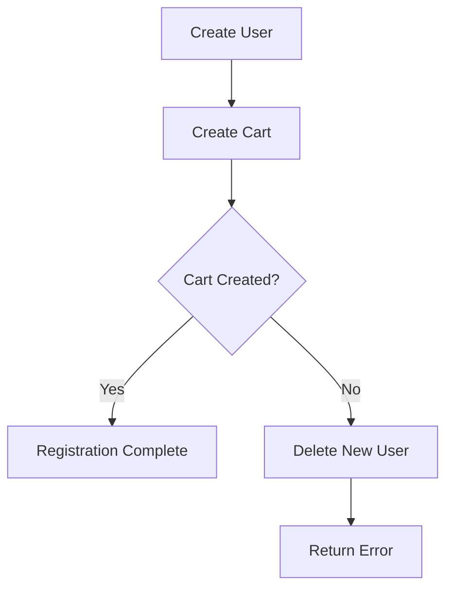

A MongoDB transaction would provide stronger atomicity but requires transaction-ready
deployment configuration. The compensating approach keeps the implementation simple
while preventing the expected partial state.

## Edge Cases

| Case | Behavior |
| --- | --- |
| Duplicate email | `409 Conflict` |
| Invalid user or item ObjectId | `400 Validation Failed` |
| Unknown user | `404 User not found` |
| Missing active cart | `404 Cart not found` |
| Missing or cross-cart item | `404 Item not found` |
| Empty checkout cart | `400 Cart is empty` |
| Zero or negative quantity | Rejected |
| Negative or zero API price | Rejected |
| Duplicate product ingestion | Quantity incremented |
| Multiple active cart attempt | Rejected by service/index |
| More than 100 API requests | `429 Too Many Requests` |
| Unknown route | Structured `404` |
| Production failure | Stack trace omitted |
| Expired cart | Removed asynchronously by MongoDB |

## Trade-offs

### Separate CartItem collection

Advantages:

- Efficient item-level updates
- Independent item queries
- Clear item model and index
- No large cart-array rewrites

Costs:

- Additional query to assemble the cart
- TTL cart deletion does not cascade automatically

### Client-provided price

The current API accepts item price because a product catalog is outside scope.
Production systems should resolve product data and price from a trusted server-side
catalog to prevent price manipulation.

### Client-provided user ID

This supports ownership-scoped queries but is not authentication. A real deployment
should derive the user ID from a verified token.

### In-memory rate-limit store

The default store works for one API process. Multiple instances should use a shared
store such as Redis so all processes enforce one consistent request count.

### Default CORS behavior

Default CORS is convenient for development. Production should configure explicit
allowed origins, methods, and headers.

### Checkout as a calculation

Checkout currently calculates pricing only. This avoids premature order/payment
complexity but does not lock prices, reserve inventory, or persist a transaction.

## Scalability and Future Evolution

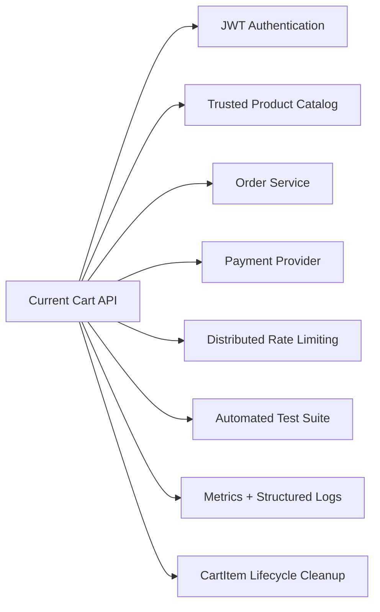

Recommended next steps:

1. Add JWT authentication and derive user identity from the token.
2. Replace client-supplied prices with catalog lookups.
3. Add MongoDB transactions for multi-document workflows.
4. Add order creation and payment processing.
5. Add orphan CartItem cleanup for TTL-deleted carts.
6. Move rate-limit state to Redis for horizontal scaling.
7. Restrict CORS by environment.
8. Add unit, integration, and load tests.
9. Add OpenAPI documentation.
10. Add containerization, CI/CD, metrics, tracing, and structured logs.
